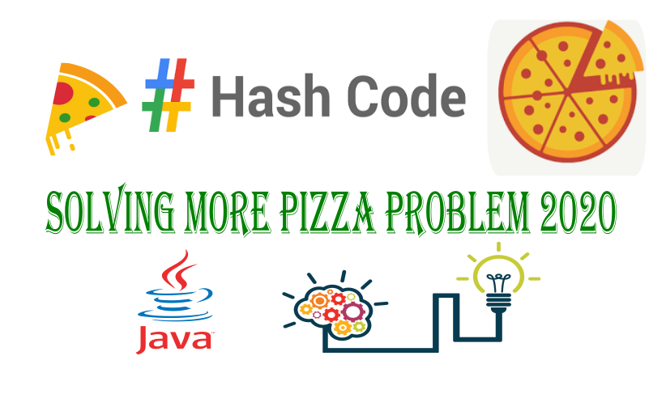

# solving more pizza problem hash code google compition 2020 using java

in this video we try together to analyse the problem, proposing an algorithm , after that we will implement this solution using java language, finally we'll submit the solution into google.
- video explanation :https://www.youtube.com/watch?v=ubAKFBvV0pc&t=75s

